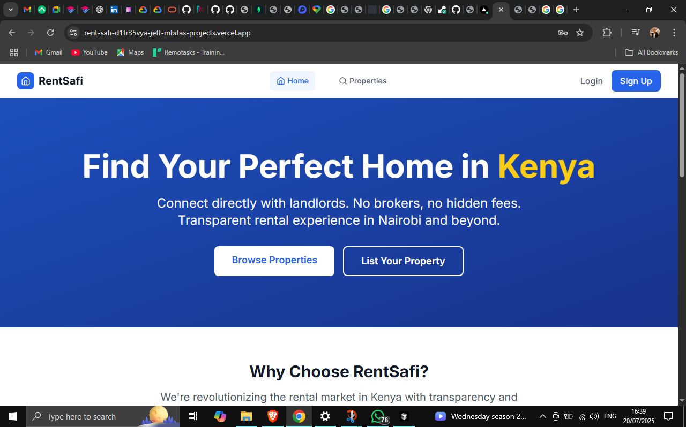
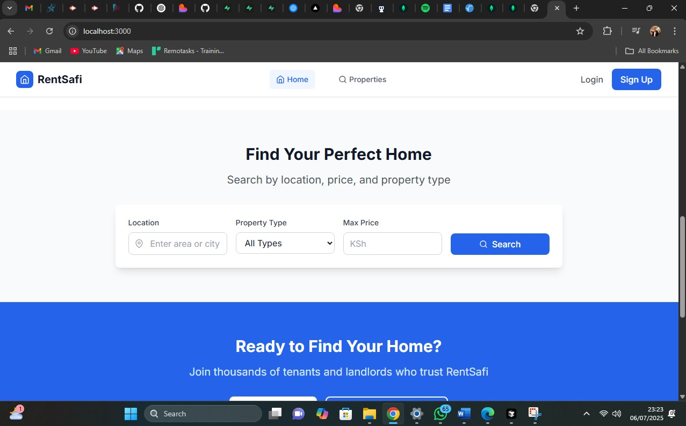
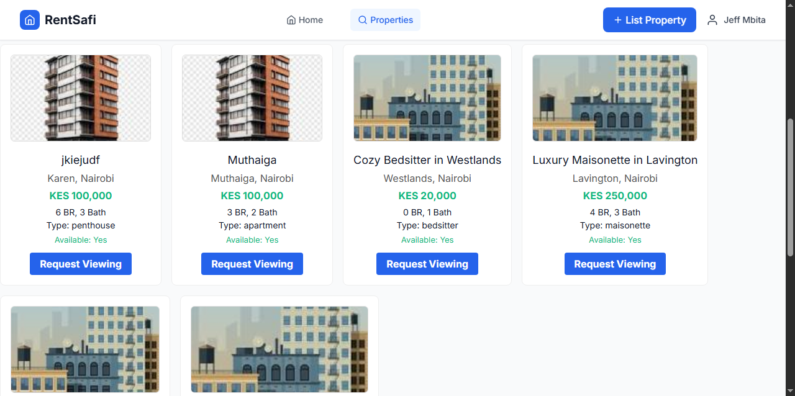
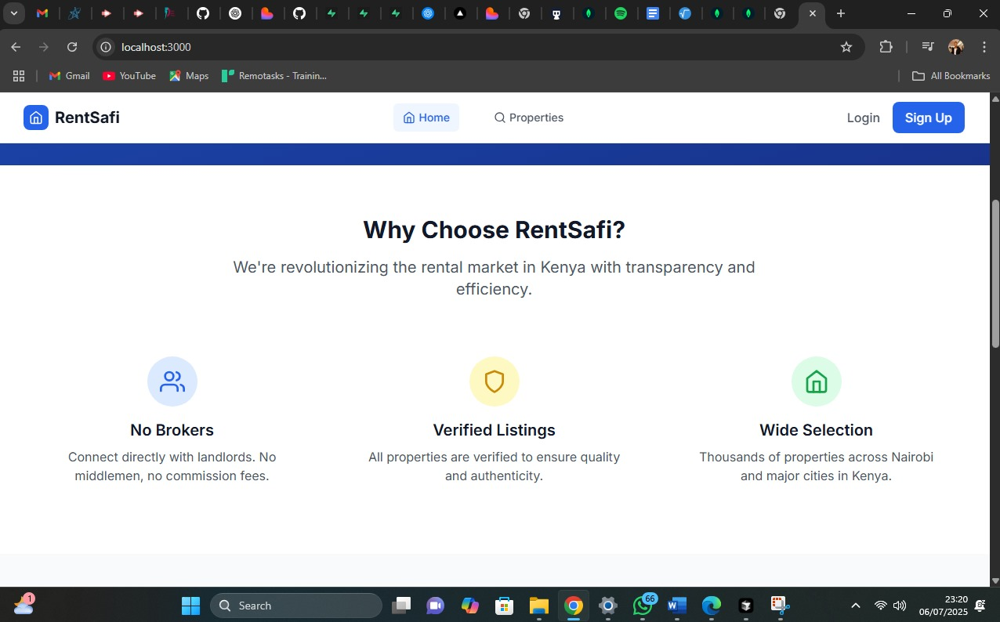
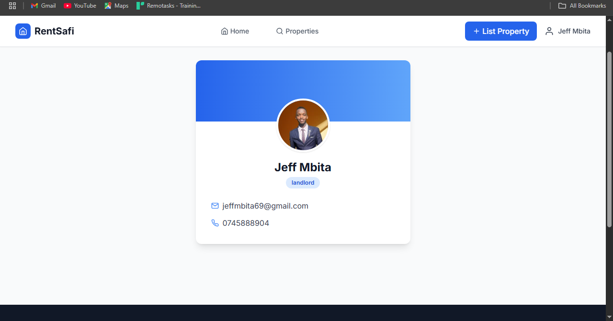

# RentSafi

RentSafi is a full-stack MERN application for the Kenyan rental market. It connects tenants and landlords, allowing users to search, book, and manage property rentals with real-time chat, booking requests, and a modern, user-friendly interface.

---

## 🚀 Live Demo
- **Frontend:** [https://rent-safi-git-main-jeff-mbitas-projects.vercel.app/](https://rent-safi-git-main-jeff-mbitas-projects.vercel.app/)
- **Backend API:** [https://rent-safi.onrender.com/](https://rent-safi.onrender.com/)

---

## 📸 Screenshots

> _Add screenshots of your Home page, property search, booking modal, dashboard, and chat here._

- 
- 
- 
- 
- 

---

## 🎥 Video Demonstration

[](https://youtu.be/H8S2EkUk6qQ)

---

## 📝 Project Description

RentSafi is a modern property rental platform for Kenya, built with the MERN stack. It allows tenants to search and book properties, chat with landlords, and manage their favorite listings. Landlords can list properties, manage bookings, and communicate with tenants in real time.

**Key Features:**
- Tenant and landlord roles with separate dashboards
- Property search with filters and map
- Real-time chat and notifications
- Booking/viewing requests
- Add to cart/favorites
- Secure authentication and authorization
- Responsive, mobile-friendly UI

---

## ⚙️ Setup Instructions

### 1. Clone the repository
```sh
git clone https://github.com/Mbitajeff/Rent-Safi.git
cd Rent-Safi
```

### 2. Install dependencies
- For the backend:
  ```sh
  cd server
  pnpm install
  # or npm install
  ```
- For the frontend:
  ```sh
  cd ../client
  pnpm install
  # or npm install
  ```

### 3. Environment Variables
- Create `.env` files in both `/server` and `/client` (see `.env.example` if provided)
- Set up MongoDB Atlas and add your connection string to `MONGODB_URI` in `/server/.env`
- Set `VITE_API_URL` in `/client/.env` to your backend URL (for local dev, use `http://localhost:5000/api`)

### 4. Run the app locally
- Start the backend:
  ```sh
  cd server
  pnpm run dev
  # or npm run dev
  ```
- Start the frontend:
  ```sh
  cd ../client
  pnpm run dev
  # or npm run dev
  ```

---

## 📚 API Documentation

### Authentication
- `POST /api/auth/register` — Register a new user
- `POST /api/auth/login` — Login and receive JWT
- `GET /api/auth/me` — Get current user info

### Properties
- `GET /api/properties/search` — Search properties
- `POST /api/properties/:id/favorite` — Add to favorites
- `DELETE /api/properties/:id/favorite` — Remove from favorites

### Messages
- `POST /api/messages` — Send a message or viewing request

(Expand with request/response examples as needed)

---

## 👤 User Guide

### For Tenants
- Register and log in as a tenant.
- Search for properties using filters.
- Add properties to your cart/favorites.
- Request viewings and chat with landlords.
- Manage your bookings and favorites from your dashboard.

### For Landlords
- Register and log in as a landlord.
- List new properties for rent.
- View and respond to booking/viewing requests.
- Chat with tenants in real time.
- Manage your property listings from your dashboard.

---

## 🏗️ Technical Architecture Overview

- **Frontend:** React (Vite), deployed on Vercel
- **Backend:** Node.js/Express, deployed on Render
- **Database:** MongoDB Atlas
- **Real-time:** Socket.io for chat and notifications

```mermaid
flowchart TD
  A[Frontend (Vercel)] -- REST/Socket.io --> B[Backend (Render)]
  B -- MongoDB Driver --> C[(MongoDB Atlas)]
  A -- Auth (JWT) --> B
  B -- Static/Image Uploads --> D[(Cloudinary)]
```

---

## 👤 Author
- [Mbitajeff](https://github.com/Mbitajeff)

--- 